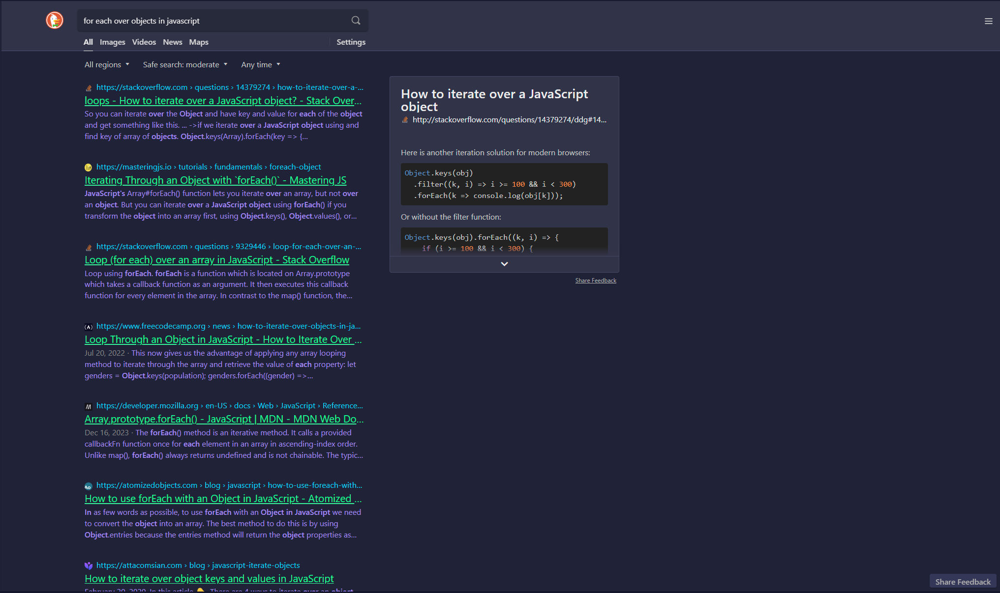

<!-- DO NOT CHANGE THIS -->
<p align="center">

</p>
<p>
Eldritch is a community-driven dark theme inspired by Lovecraftian horror. With tones from the dark abyss and an emphasis on green and blue, it caters to those who appreciate the darker side of life.
</p>

Main Theme repo can be found [here](https://github.com/eldritch-theme/eldritch)

### Showcase
<!-- Your screenshot should go here -->
<br/>

### Installation using script extension (***we recommend [ViolentMonkey](https://violentmonkey.github.io)***)
#### This will keep the theme up to date, in between sessions, and when cookies expire
1. Open extension of your choice
2. Add new script
3. Install from URL and paste the following URL:
```bash
https://raw.github.com/eldritch-theme/duckduckgo/master/script.js
```
4. Reload the page

### Installation with cookies, but without using extension
1. Open the developer console (F12)
2. Go to Console tab
3. Paste the following code and press Enter:
```javascript
var eldritch=["kae"="t","k5"="2","ku"="-1","kk21"="323449","ky"="323449","kkj"="323449","kkx"="04d1f9","kk7"="212337","kk8"="ebfafa","kk9"="37f499","kkaa"="a48cf2","kks"="t","kkw"="s","kkt"="g","kka"="g","kk1"="-1","kkav"="1","kkc"="1","kav"="1","kn"="1","k1"="-1","kak"="-1","kax"="-1","kaq"="-1","kap"="-1","kao"="-1","kau"="-1","ks"="n","kw"="w","ko"="1","ksn"="5","k7"="212337","k8"="ebfafa","k9"="37f499","km"="l","kj"="282a36","kaa"="a48cf2","kx"="04d1f9","kai"="1","kf"="1","k21"="323449","kaf"="b","kac"="1","kt"="e","ka"="e","k18"="1"];for(var i=0;i<eldritch.length;i++)document.cookie=eldritch[i];alert('Appearance settings have successfully been updated!');location.reload();
```

### Without using cookies
1. If you prefer not to use cookies, you can use DuckDuckGo's parameters via URL query params:
`https://duckduckgo.com/?kae=t&k5=2&ku=-1&kk21=323449&ky=323449&kkj=323449&kkx=04d1f9&kk7=212337&kk8=ebfafa&kk9=37f499&kkaa=a48cf2&kks=t&kkw=s&kkt=g&kka=g&kk1=-1&kkav=1&kkc=1&kav=1&kn=1&k1=-1&kak=-1&kax=-1&kaq=-1&kap=-1&kao=-1&kau=-1&ks=n&kw=w&ko=1&ksn=5&k7=212337&k8=ebfafa&k9=37f499&km=l&kj=282a36&kaa=a48cf2&kx=04d1f9&kai=1&kf=1&k21=323449&kaf=b&kac=1&kt=e&ka=e&k18=1` although this will not keep the settings between sessions.


<!-- If you want to provide install from source options, you can use the following template: -->
<!-- ### Installation From Source -->
<!-- 1. Any instructions here -->